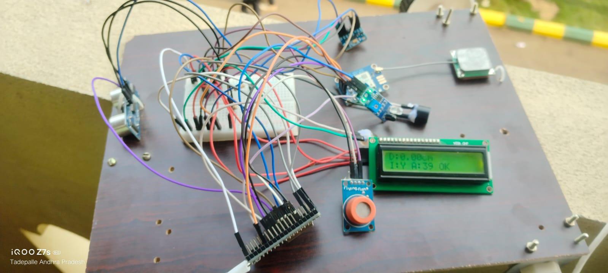

# smart-car-accident-detection
IoT-based smart car accident detection and alert system using ESP32, sensors, GPS and Telegram.
# 🚗 Smart Car Accident Detection and Alert System

## 📌 Project Overview

This project is an IoT-based smart car accident detection and alert system developed using an **ESP32 and multiple sensors**.

The system detects a possible accident using an **ADXL345 accelerometer**. When an accident is detected, the system activates a buzzer and LED and sends an alert message containing the vehicle's GPS location through **Telegram**.

The project was developed using **Arduino IDE**.

## 🎯 Objectives

* Detect possible vehicle accidents
* Obtain the vehicle's GPS location
* Send accident alerts through Telegram
* Monitor alcohol sensor readings
* Measure distance using an ultrasonic sensor
* Display sensor information on an LCD
* Provide local alerts using a buzzer and LED

## 🔧 Hardware Components

* ESP32
* ADXL345 Accelerometer
* NEO-6M GPS Module
* HC-SR04 Ultrasonic Sensor
* IR Sensor
* MQ-3 Alcohol Sensor
* 16×2 I2C LCD
* Buzzer
* LED
* Resistors
* Breadboard and jumper wires

## 💻 Software and Technologies

* Arduino IDE
* Embedded C/C++
* ESP32
* GPS
* Wi-Fi
* Telegram Bot
* IoT

## ⚙️ Working Principle

1. The ESP32 initializes all connected sensors and modules.
2. The ADXL345 continuously measures acceleration.
3. The system calculates the overall acceleration value.
4. If the acceleration exceeds the defined threshold, a possible accident is detected.
5. The buzzer and LED are activated as local indicators.
6. The GPS module provides the vehicle's latitude and longitude.
7. The ESP32 connects to the Internet through Wi-Fi.
8. A Telegram message is sent containing the accident alert and GPS location.
9. The LCD displays distance, IR sensor status, alcohol sensor information and accident status.

## 📡 System Flow

```text
Sensors
   ↓
ESP32
   ↓
Accident Detection
   ↓
 ┌───────────────┐
 │ Accident?     │
 └───────┬───────┘
         │
        YES
         ↓
   Buzzer + LED
         ↓
    GPS Location
         ↓
       Wi-Fi
         ↓
   Telegram Alert
```

## 📲 Telegram Alert

When an accident is detected and valid GPS information is available, the system sends an alert through Telegram containing:

* Accident notification
* Alcohol sensor reading
* GPS coordinates
* Google Maps location

## 📷 Hardware Setup



## 🔌 Circuit Diagram


## 🚀 Future Improvements

* Add automatic emergency calling
* Add cloud-based monitoring
* Add a web/mobile dashboard
* Improve accident detection using multiple sensor parameters
* Add vehicle speed monitoring
* Add emergency contact management
* Support multiple vehicles

## 👩‍💻 Author

**Tejasri**

B.Tech Electronics and Communication Engineering Student
